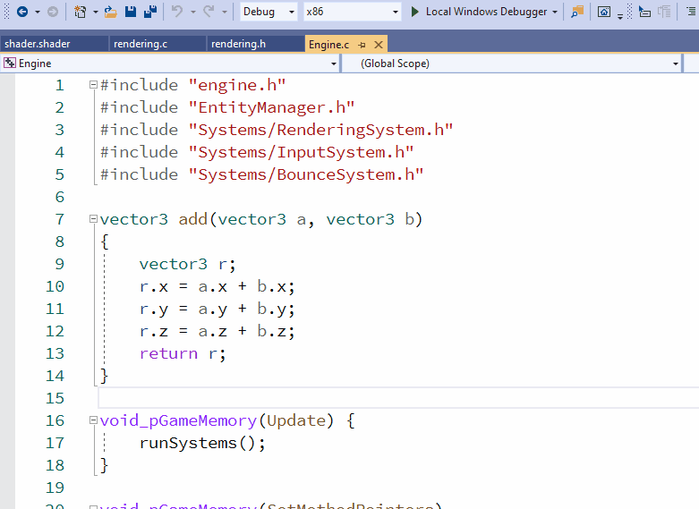

# DOD Engine

Game Engine develop to put in practice data-oriented design wisdom
and learn the C language and Direct 3D in a hands-on way.

So far I'm implementing a pong game but I expect to improve upon this engine and create more sophisticated games.

DLL hot reloading and ECS with a single block of memory to store the entities as a list of archetypes (groups of components).

The way the DLL reloading is implemented it allows me to support other platforms "easily" or at least in theory.

I expect to replace Direct X SDK implementing a simple math lib

- Direct 3D 11
- Only C language 
- DLL Hot Reload
- ECS

# Build instructions

1. Install [Direct x SDK](https://www.microsoft.com/en-us/download/details.aspx?id=6812)
2. Clone the Repo
3. Build with Visual Studio 2019

# Resources I Follow

- http://www.rastertek.com